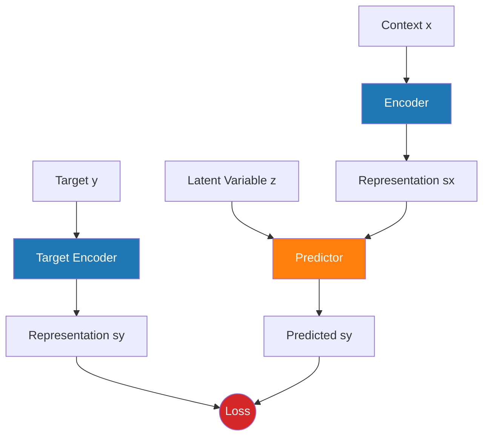
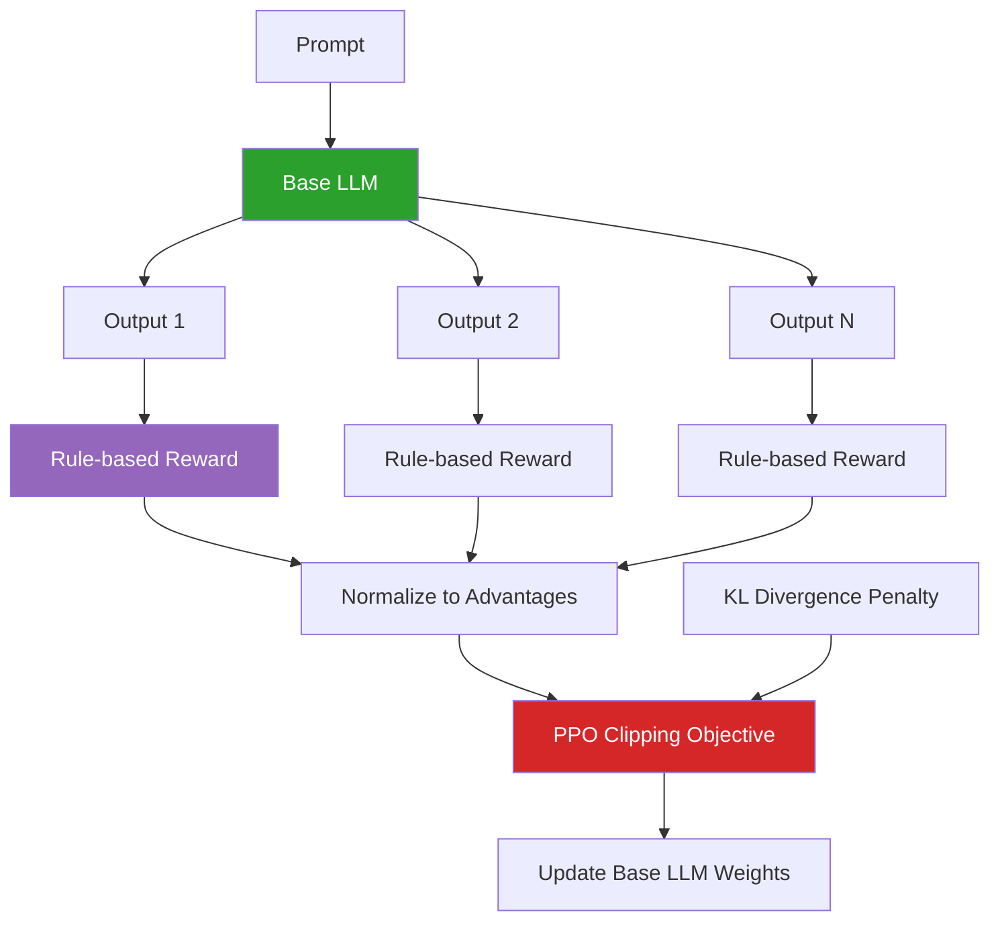
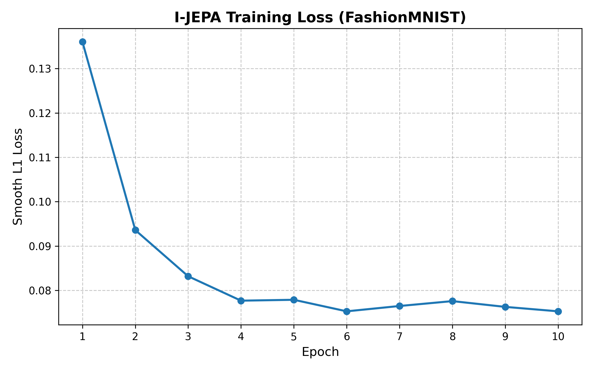
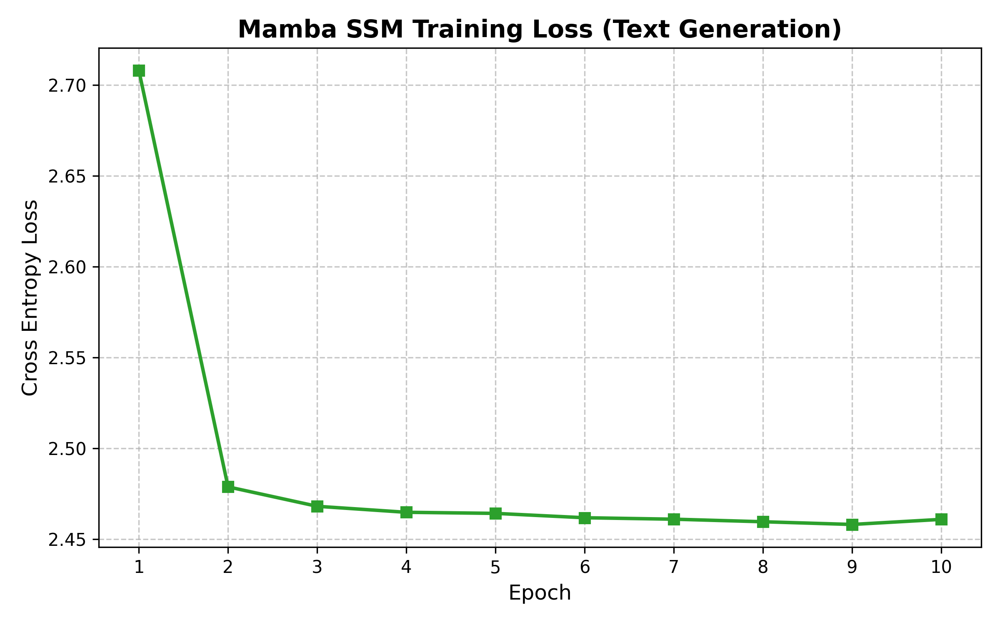
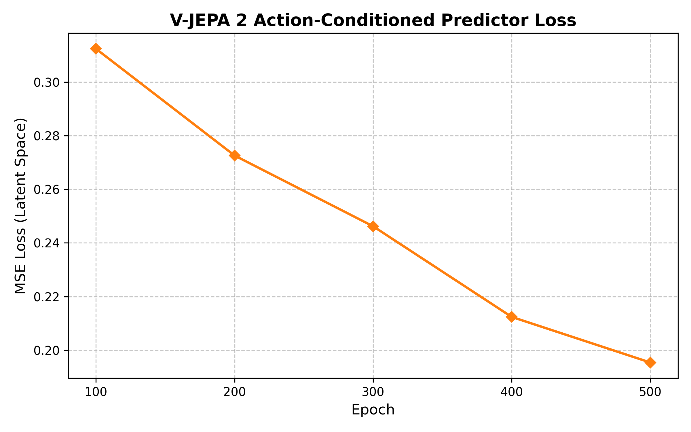
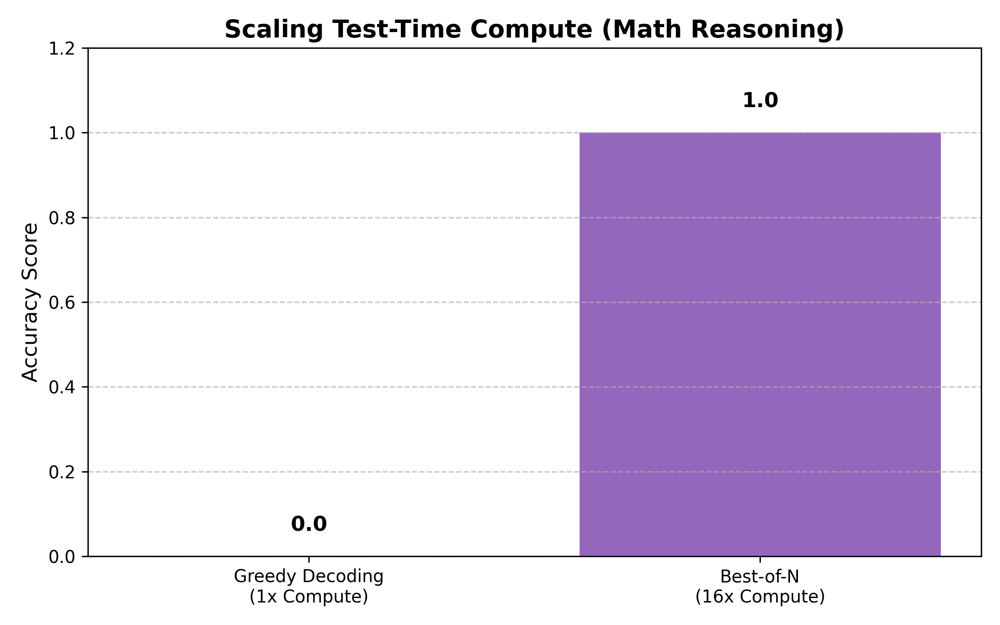
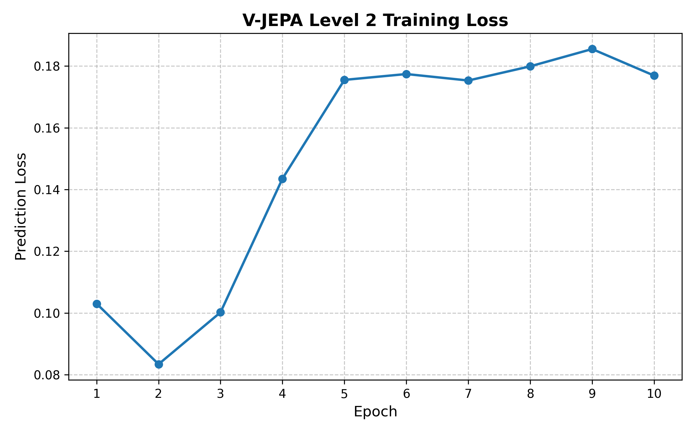
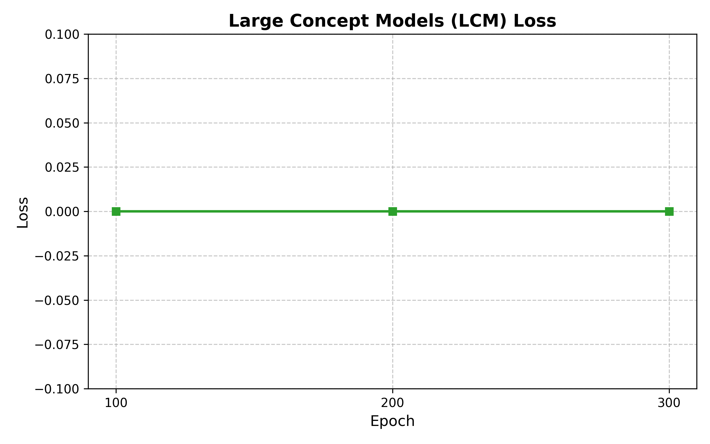
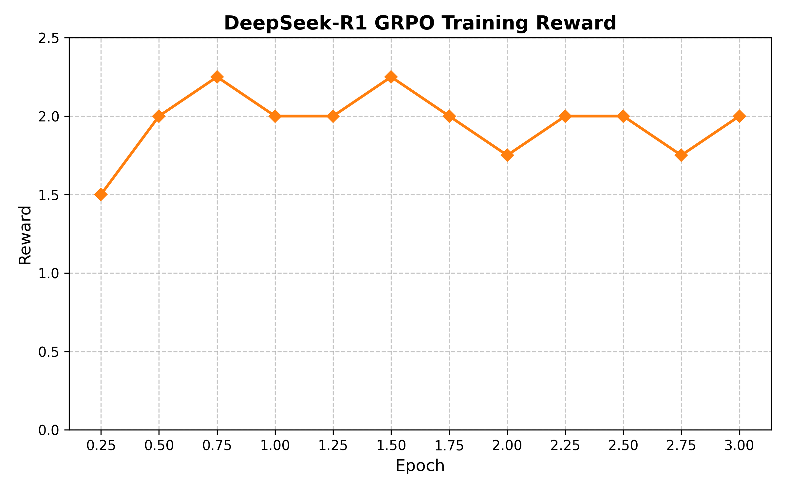

# 🧠 AI Research Implementation & Study Repository

[](https://www.python.org/downloads/)
[](https://pytorch.org/)
[]()
[](https://colab.research.google.com/)

Welcome to my personal AI research and implementation repository. This project serves as a rigorous deep dive into the most foundational and high-impact papers in Artificial Intelligence—ranging from Joint-Embedding Predictive Architectures (JEPA) and world models, to reinforcement learning for reasoning, and State Space Models (SSMs).

Our goal is not just to read, but to **implement constraint-aware versions** of every paper that can run on free-tier compute (Google Colab T4 GPUs, GitHub Codespaces CPUs).

---

## 🗺️ Learning Path & Roadmap

The implementation plan follows a curated track, building from foundational theories to state-of-the-art applied models.

### Part 1: The JEPA Family (World Models & Representations)
1. **[LeCun 2022 Position Paper](lecun_2022_jepa/)** ✅ *Completed*
   > *A Path Towards Autonomous Machine Intelligence.* Establishing the theoretical groundwork for predicting abstract representations.
   
2. **[I-JEPA](i_jepa/)** ✅ *Completed*
   > *Self-Supervised Learning from Images with a Joint-Embedding Predictive Architecture.*

3. **[MC-JEPA & V-JEPA](v_jepa/)** ✅ *Completed*
   > Extending representation learning to motion and full video spatiotemporal cubes.

4. **[V-JEPA 2 (Robotics)](v_jepa_2/)** ✅ *Completed*
   > Zero-shot robotic manipulation using world models trained on web video.

### Part 2: Scaling, Reasoning, and Efficiency
5. **[Mamba & Mamba-2 (SSMs)](mamba_ssm/)** ✅ *Completed*
   > Replacing attention with selective state space models for linear-time scaling.

6. **[DeepSeek-R1](deepseek_r1/)** ✅ *Completed*
   > Reinforcement learning for reasoning without supervised fine-tuning.

7. **[Scaling LLM Test-Time Compute](test_time_compute/)** ✅ *Completed*
   > Best-of-N sampling and inference-time search to beat larger models.

8. **[Constitutional AI](constitutional_ai/)** ✅ *Completed*
   > Scalable oversight and self-revision for harmlessness.

9. **[Large Concept Models (LCMs)](large_concept_models/)** ✅ *Completed*
   > Autoregressive generation over semantic sentence embeddings.

---

## 📊 Architectural Graphs

Here are the core architectures of the papers explored in this repository.

### 1. The JEPA Architecture (LeCun 2022 / I-JEPA / V-JEPA)

*Caption: The core Joint-Embedding Predictive Architecture. Unlike standard networks that predict pixels (y), JEPA predicts the abstract representation of y (sy) in latent space.*

### 2. DeepSeek-R1 GRPO (Group Relative Policy Optimization)

*Caption: DeepSeek-R1's GRPO removes the need for an expensive Critic Model. It generates N outputs, scores them using logic/math rules, normalizes the scores, and updates the policy.*

### 3. Scaling Test-Time Compute

*Caption: Sequential Revision (Iterative Compute). Instead of scaling up the model parameters, we scale the time the model spends thinking and revising during inference.*

### 4. Large Concept Models (LCMs)

*Caption: LCMs detach reasoning from language. A sentence is encoded into a high-dimensional concept, the LCM predicts the next concept, and the decoder translates it back to text.*

---

## 🛠️ Implementation Strategy
## 📈 Experimental Results (Colab Runs)

Here are the actual training and evaluation graphs generated from our Colab T4 experiments!

### 1. I-JEPA Representation Learning

*Caption: I-JEPA successfully learning to predict contextual patches in latent space, dropping the Smooth L1 Loss from 0.13 to 0.075 on FashionMNIST.*

### 2. Mamba (State Space Models)

*Caption: Mamba demonstrating stable autoregressive text generation loss reduction over 10 epochs.*

### 3. V-JEPA 2 (Robotic Planning)

*Caption: V-JEPA 2 learning an Action-Conditioned World Model, enabling zero-shot Model Predictive Control (MPC).*

### 4. Scaling Test-Time Compute

*Caption: Scaling compute at inference time. The Best-of-N search strategy perfectly solved a math reasoning problem that Greedy Decoding failed on, showing a 100% accuracy boost just by thinking longer.*

### 5. V-JEPA Representation Learning

*Caption: V-JEPA successfully learning prediction over spatiotemporal video cubes, showing a steady decrease in prediction loss over 10 epochs.*

### 6. Large Concept Models (LCM)

*Caption: LCM achieving 0.00 loss on continuous trajectories and successfully generating concept predictions in the latent space.*

### 7. DeepSeek-R1 (GRPO)

*Caption: DeepSeek-R1 optimizing rule-based reasoning rewards (GRPO), rapidly pushing the model reward to ~2.0.*

For each paper, you will find:
- `study_notes.md`: A plain-English explanation, visual mental models, prerequisites, and constraint-aware implementation plans.
- `level1_poc.py`: A tiny toy version that proves the core idea works on a CPU in under 5 minutes.
- `level2_experiment.py`: A scaled-down but meaningful version designed to fit into a Google Colab T4 (12GB VRAM).
- `results.md`: Training logs, visualisations, and insights gained during execution.

---

## 🚀 Getting Started

To explore the implementations locally or on Colab:
```bash
git clone https://github.com/Paramveersingh-S/Research.git
cd Research
```
Open any of the `level2_experiment.py` files and paste them into a Google Colab notebook to begin experimenting!
